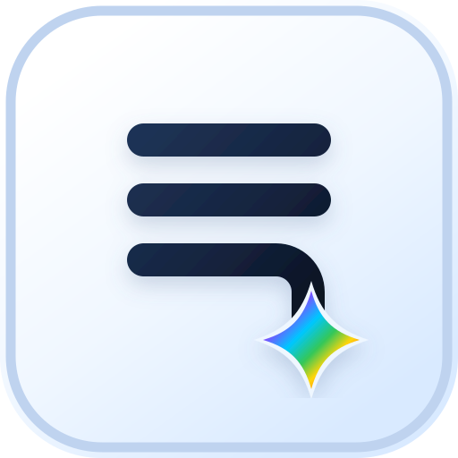

<div align="center">
  

  <h1>Vibenote</h1>

  <p><strong>沉浸式、顺手、AI Native 的纯文本笔记。</strong></p>

  <p>
    <a href="https://github.com/elliotxx/vibenote"></a>
    
    
    
    
  </p>

  <p>
    <a href="./README.md">English</a>
    |
    简体中文
  </p>
</div>

## 概览

Vibenote 是一个面向 macOS 的本地纯文本笔记应用。它把所有内容放在一个持续增长的 note stream 里，用 block 区分不同笔记内容，让你像瀑布流一样无脑记录，不需要先决定目录、文件、语法或格式。

首发版本聚焦极简记录体验：单窗口、单 buffer、纯文本、自动保存、按 block 切分内容，并保留对 Markdown、JSON、JavaScript/TypeScript、Python、SQL 等常见内容的轻量语言识别和格式化能力。

## 为什么是 Vibenote

- **沉浸式记录**：没有目录树、tab 和多 buffer 切换，打开就是唯一的 note stream。
- **顺手输入**：通过快捷键快速新增、拆分、删除和跳转 block，适合边想边写。
- **纯文本优先**：内容保存为本地 `stream.txt`，可读、可备份、可长期保存。
- **Block 作为边界**：每段笔记都是独立 block，可以拥有自己的语言模式和自动识别状态。
- **AI Native，但不破坏内容**：AI 能围绕 block 边界做辅助，但不承担全局整理和重写，避免对原始记录造成破坏性修改。

## 当前功能

- 一个持久化 note stream。
- Block 级编辑、新增、删除、拆分、跳转和选择。
- Block 级语言选择与自动识别。
- 当前 block 格式化。
- 粘贴图片后保存到本地应用数据目录，并在正文中引用。
- 自动保存和退出前同步保存。
- macOS 全局显示/隐藏快捷键。
- 本地应用数据隔离，不读取、迁移或修改 Heynote 数据。

## 首发范围

Vibenote `0.1.0` 首发只支持 macOS arm64。为了保持简单，当前版本不包含多 buffer、tab、侧边栏目录树、全文搜索、命令面板、block folding、云同步或 Heynote 数据迁移。

## 快速开始

最快的方式是让本地 AI coding agent 从源码帮你安装。把下面这段 prompt 复制到 Codex、Claude Code 或其他能在本机执行 shell 命令的 agent 里：

```text
请在这台 Mac 上从 https://github.com/elliotxx/vibenote 安装 Vibenote。

要求：
- 不要读取、迁移或修改任何 Heynote 数据。
- 将仓库 clone 或更新到 $HOME/workspace/vibenote。
- 使用 npm 安装依赖。
- 使用 npm run release:mac 构建未签名的 macOS arm64 安装包。
- 校验 dist/SHA256SUMS。
- 挂载 dist/Vibenote-0.1.0-arm64.dmg，将 Vibenote.app 复制到 Applications 文件夹，卸载 DMG，并启动应用。
- 如果 macOS 拦截未签名应用，请告诉我准确的 Finder 右键打开或“隐私与安全”放行步骤。
```

手动安装：

1. 下载或构建 `Vibenote-0.1.0-arm64.dmg`。
2. 如果同时提供了 `SHA256SUMS`，先校验文件哈希。
3. 打开 DMG，将 `Vibenote.app` 拖到 Applications 文件夹。
4. 启动 Vibenote。
5. 首次启动如被 macOS 拦截，请在 Finder 中打开 Applications 文件夹，右键点击 `Vibenote.app`，选择“打开”，再确认弹窗。
6. 如果右键打开仍被拦截，请进入“系统设置 > 隐私与安全”，在安全提示处允许打开 Vibenote。

只把未签名试用包发给信任构建来源的人，不要把它包装成普通公开 macOS release。

## 快捷键

| 操作 | macOS 快捷键 |
| --- | --- |
| 显示或隐藏应用 | `Cmd+Shift+Space` |
| 在当前 block 后新增 block | `Cmd+Enter` |
| 在当前 block 前新增 block | `Option+Enter` |
| 在 note stream 末尾新增 block | `Cmd+Shift+Enter` |
| 在 note stream 开头新增 block | `Shift+Option+Enter` |
| 从光标处拆分 block | `Cmd+Option+Enter` |
| 删除当前 block | `Cmd+Shift+D` 或 `Ctrl+Shift+D` |
| 选择当前 block，再按一次全选 | `Cmd+A` |
| 跳到上一个 block | `Cmd+Up` |
| 跳到下一个 block | `Cmd+Down` |
| 在上方添加多光标 | `Cmd+Option+Up` |
| 在下方添加多光标 | `Cmd+Option+Down` |
| 聚焦语言选择器 | `Cmd+L` |
| 格式化当前 block | `Shift+Option+F` |

## 数据位置

Vibenote 使用独立的 Electron `userData` 目录：

```sh
~/Library/Application Support/Vibenote/notes/stream.txt
~/Library/Application Support/Vibenote/notes/.images/
```

卸载应用：

```sh
rm -rf "/Applications/Vibenote.app"
```

只有在确认不再需要笔记内容时，才删除应用数据：

```sh
rm -rf "$HOME/Library/Application Support/Vibenote"
```

## 开发者须知

开发运行：

```sh
npm install
npm run dev
```

如果 Electron 二进制下载受限，可以先只检查浏览器渲染层：

```sh
npx vite --host 127.0.0.1 --port 3344 --strictPort
```

浏览器渲染层在没有 Electron preload 时会使用 localStorage mock，不会写入真实应用数据。

构建 macOS 试用安装包：

```sh
npm run release:mac
```

构建产物：

- `dist/Vibenote-0.1.0-arm64.dmg`
- `dist/SHA256SUMS`

当前发布模式是**通过 tag 触发的 macOS release 分发**。应用未签名、未公证，用户需要理解 macOS 首次启动拦截提示。大范围分发前仍需要 Developer ID 签名和 Apple notarization。

分享前可以校验产物：

```sh
cd dist
shasum -a 256 -c SHA256SUMS
```

### 发布

Vibenote 通过 tag 触发发布。推送与 `package.json` 版本一致的版本 tag：

```sh
git tag v0.1.0
git push origin v0.1.0
```

GitHub Actions 会构建 macOS arm64 DMG，校验 `SHA256SUMS`，并创建正式 GitHub Release，上传 DMG 和 checksum 文件。当前构建仍然未签名、未公证。

### 技术栈

- Electron 41
- Vue 3
- Pinia
- CodeMirror 6
- Prettier
- ripgrep via `@vscode/ripgrep`
- electron-builder

### 验证

```sh
npm run build
npm run verify:package
npm run verify:runtime
npm run verify:stability
npm run verify:edges
npm run verify:install
```

验证脚本覆盖安装包结构、DMG 内容、运行时输入、退出保存、删除 block、格式化异常保护，以及从 `/Applications` 启动安装后的应用。

更多首发候选检查项见 [RELEASE.md](./RELEASE.md)。

## 贡献

欢迎围绕极简记录体验提交改进。首发阶段优先关注：

- 数据保存可靠性。
- Block 编辑体验。
- macOS 打包和小范围试用分发。
- 公开分发前的 Developer ID 签名和公证。
- 快捷键一致性。
- AI Native 的非破坏式辅助能力。

提交信息请使用 Conventional Commits。

## 许可证

当前仓库尚未声明许可证。公开分发前请补充 `LICENSE` 文件。
